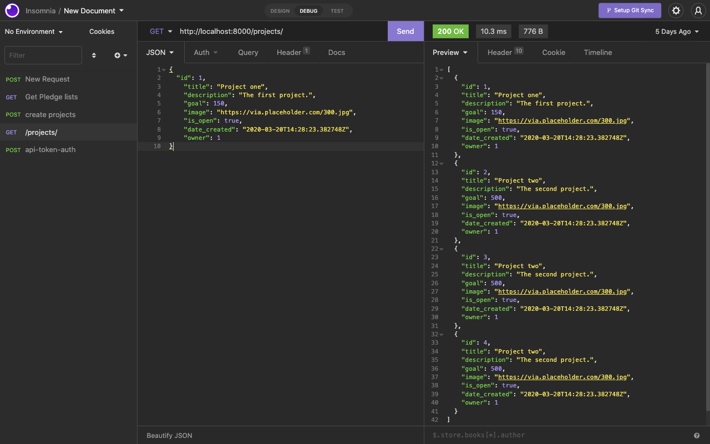
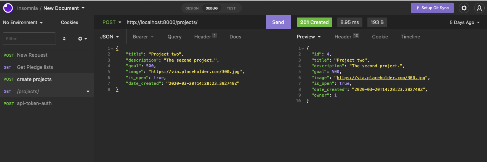
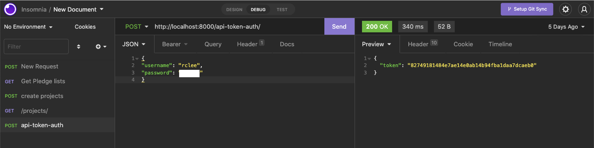

# **SheCodes - Crowdfunding Project (Part A)**

This is my Crowdfunding project, Part A submission using Django REST Framework. **Django Rest Framework** is a powerful and flexible toolkit for building web APIs (Application Programming Interface) that reduces the amount of code you need to write to create REST interfaces. 

## MVP Plan 

### Title

The new kickstarter website will be called **comm-YOU-nity**

### Purpose & Target Audience

They say it takes a village to raise a child, why stop at one child? The purpose of this site will be to raise money to help and support community projects. It will be a collection of different community projects from sustainability and evironmental projects to helping families survive the rising costs of living expenses.  

The target audience will be anyone and everyone who is looking at kickstarter a community project. 

### Features

Current features that are present in this version gives the user the ability to:
- POST a new pledge
- GET a specific pledge using an ID number
- GET all projects
- GET all users
- CREATE an authorisation token
- POST a new project

The project will be expanded to include the following features: 
- POST anoymously 
- DELETE a project
- UPDATE a project
- CONTACT a project owner
- FILTER projects by location 
- SORT function e.g. goal targets and post dates

### API Specification

Not sure what this means, must have missed this topic. However, it must mean API documentation on how the site will function with the API and since I have no idea what an API is at it's core, I can hardly write documentation how my site will implement this. This will be actioned in the coming weeks when I can understand better on the format and functionality of what this documentation is. 

### Database Schema

Little unsure what this requirement is asking to provide. I understand the concept of Database Schema from when I created one in University for SQL Databases but I don't remember when we had discussed this or what is required for this part.  

### Wireframes 

Wireframes for the [website home page](https://balsamiq.cloud/s9m2dw2/p3mlhil)

Please note: That I will develop more wireframes as the project develops. 

### Colour Scheme

- '#11ABC1' 
- '#DF3062'
- '#F5B935' 
- '#4BAC3F'

### Heading and body fonts

- Heading fonts (H1 to H5) = Poppins
- Body text = Poppins 
- Highlight text = SF Mono / Fira Code

## Part A Submission

### Hosting

Part A sumbmission of my crowdfunding project is hosted by Heroku. 

Please visit [my project via Heroku](https://gentle-harbor-58349.herokuapp.com/)

### Insomnia 

Insomnia is used for testing and validating results of RESTful applications. Screen shots below shows the application using various GET and POST methods:

GET request:

POST request:

POST Token request:

